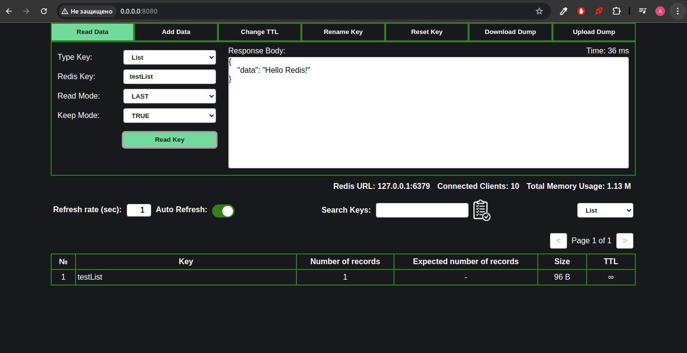
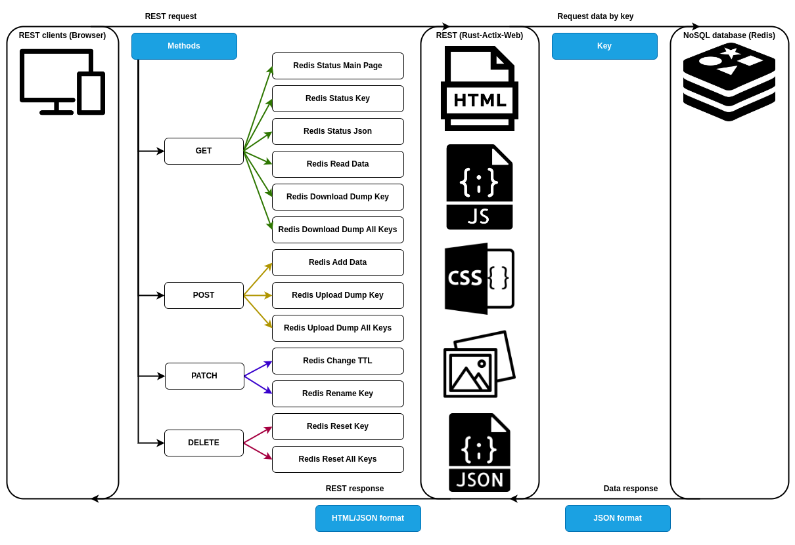
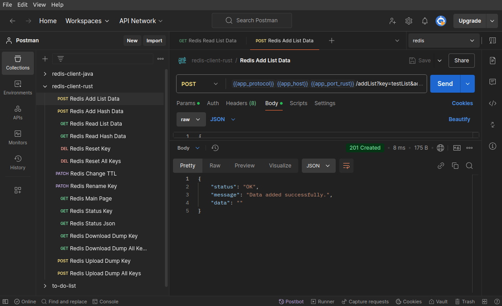
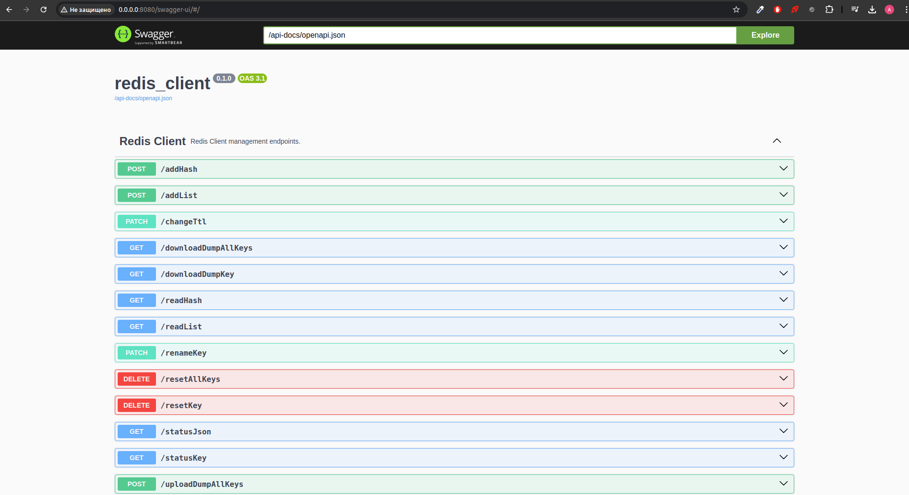
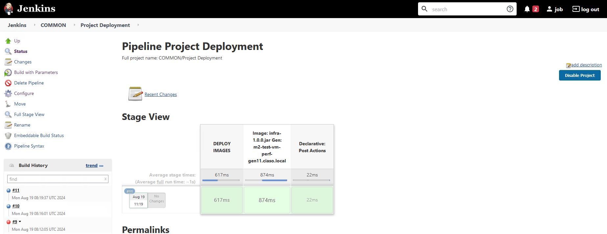
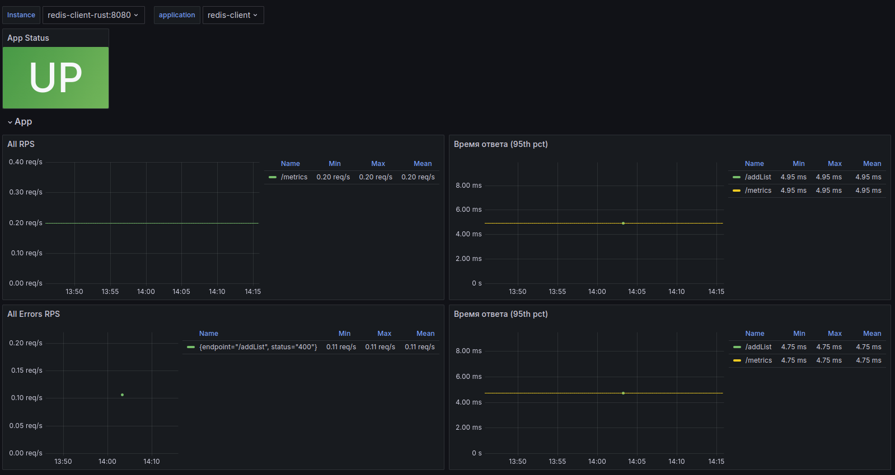
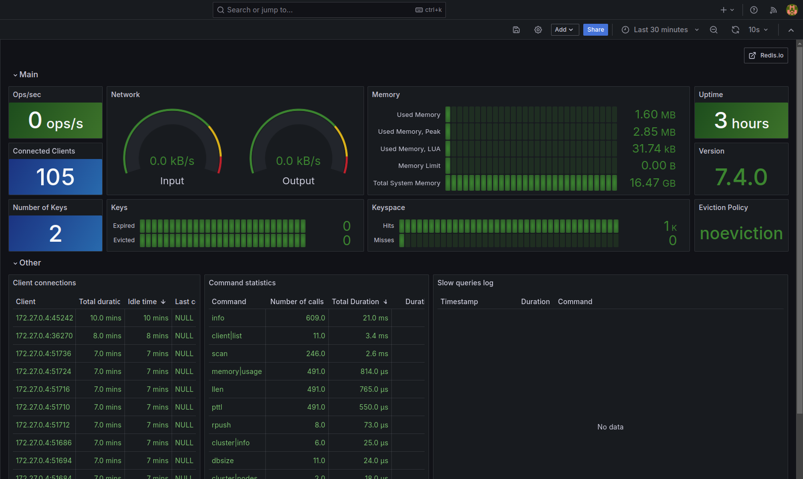

# Redis-Client-Rust 1.0



## Архитектура приложения



## Postman Collection



Postman collection можно посмотреть в папке **postman**.

**СЦЕНАРИИ:**

1. **Redis Add List Data** - Добавить запись по ключу (List);
2. **Redis Add Hash Data** - Добавить запись по ключу (Hash);
3. **Redis Read List Data** - Чтение из базы по ключу (List);
4. **Redis Read Hash Data** - Чтение из базы по ключу (Hash);
5. **Redis Reset Key** - Удалить данные из базы с определённым ключом;
6. **Redis Reset All Keys** - Удалить все данные из Redis;
7. **Redis Change TTL** - Смена TTL (изменение времени жизни данных);
8. **Redis Rename Key** - Изменение имени ключа в Redis;
9. **Redis Main Page** - Запрос статуса (Main Page);
10. **Redis Status Key** - Запрос статуса ключа;
11. **Redis Status Json** - Запрос статуса в формате Json;
12. **Redis Download Dump Key** - Скачивание дампа по ключу из Redis;
13. **Redis Download Dump All Keys** - Скачивание дампа всех ключей из Redis;
14. **Redis Upload Dump Key** - Загрузка дампа в Redis;
15. **Redis Upload Dump All Keys** - Загрузка дампа со всеми ключами в Redis.

## Swagger



Ссылка на Swagger: <http://localhost:8080/swagger-ui/#/>

## Как развернуть Redis-Client в Docker

### Docker Compose

- С параметрами запуска можно ознакомиться в docker-compose.yml;
- Параметр port для redis и redis-client берётся из файла .env.

Команда для запуска контейнеров (redis, redis-client-rust).

**Первый вариант (для просмотра процесса сборки в терминале):**

```bash
sudo docker-compose up
```

**Второй вариант (для сборки в фоновом режиме):**

```bash
sudo docker-compose up -d
```

### Docker run

#### 1. Запуск Redis

- 1.1 Скачать образ Redis.

```bash
sudo docker pull redis
```

- 1.2 Сохранить образ в .tar архив.

```bash
sudo docker save redis:latest > redis.tar
```

- 1.3 Загрузить образ из .tar архива в Docker.

```bash
sudo docker load -i redis.tar
```

- 1.4 Команда для запуска Redis в контейнере.

```bash
sudo docker run --name redis \
                --privileged \
                -d -p 6379:6379 \
                -v /path/to/local/data:/data redis:latest
```

- 1.5 Команда для подключения к контейнеру.

```bash
docker exec -it redis redis-cli
```

#### 2. Запуск Redis-Cilent-Rust приложения

- 2.1 Сборка докер образа из файла Dockerfile.

```bash
sudo docker build -t redis-client-rust:v1.0 .
```

- 2.2 Сохранение образа в .tar архив.

```bash
sudo docker save redis-client-rust > redis-client-rust.tar
```

- 2.3 Загрузка образа из .tar архив в Docker.

```bash
sudo docker load -i redis-client-rust.tar
```

- 2.4 Запуск контейнера redis-client-rust.tar

```bash
sudo docker run --name redis-client-rust \
            -p 8080:8080 \
            -e REDIS_HOST=localhost \
            -e REDIS_PORT=6379 \
            -e REDIS_POOL_CONNECTION=100 \
            -e WORKERS=16 \
            -e MULTIPART_TOTAL_LIMIT=2 \
            -e MULTIPART_MEMORY_LIMIT=100 \
            -e REQUEST_TIMEOUT_SEC=60 \
            --rm \
            redis-client-rust:v1.0
```

Описание параметры запуска:

1. **REDIS_HOST** - хост редис;
2. **REDIS_PORT** - порт редис;
3. **REDIS_POOL_CONNECTION** - пул подключений к редису;
4. **WORKERS** - количество выделенных ядер;
5. **MULTIPART_TOTAL_LIMIT** - предел загружаемого файла (**ГБ**);
6. **MULTIPART_MEMORY_LIMIT** - выделенная ОЗУ для загрузки файла (**МБ**)
7. **REQUEST_TIMEOUT_SEC** - максимальное время ожидания ответа.

## Jenkins Job для автоматизации развёртывания проекта на нагрузочном стенде



Путь к коду Jenkins Job: **./jenkins/project_deployment.groovy**.

**Перед первым запуском нужно добавить параметры в groovy скрипт.**

```groovy
environment {
    // Креды пользователя для подключения по ssh и scp
    // !!! Перед запуском джобы подставить параметры !!!
    USERNAME = ''
    CREDENTIAL = ''
}
```

Параметры JSON:

1. **genImages** - Стенд на котором находятся образы;
2. **pathImages** - Путь до образов;
3. **images** - Массив образов которые надо скачать в рабочее пространство Jenkins;
4. **type** - Вспомогательная информация (Может быть .rs, Docker Run);
5. **imageName** - Название образа;
6. **gen** - Стенд на котором надо развернуть образ;
7. **commands** - Список команд для развёртывания.

Пример JSON:

1. JSON для развёртывания проекта через бинарный файл (Redis-Client-Rust):

    ```json
    {
        "genImages": "",
        "pathImages": "",
        "images": [
            {
                "type": ".rs",
                "imageName": "redis_client",
                "gen": "",
                "commands": [
                    "sudo REDIS_HOST=localhost REDIS_PORT=6379 REDIS_POOL_CONNECTION=100 WORKERS=16 MULTIPART_TOTAL_LIMIT=2 MULTIPART_MEMORY_LIMIT=100 REQUEST_TIMEOUT_SEC=60 ./redis-client > /dev/null 2>&1 &"
                ]
            }
        ]
    }
    ```

2. JSON для развёртывания проекта через Docker Run (Redis и Redis-Client-Rust):

    ```json
    {
        "genImages": "",
        "pathImages": "",
        "images": [
            {
                "type": "Docker Run",
                "imageName": "redis.tar",
                "gen": "",
                "commands": [
                    "sudo docker stop redis 2>/dev/null || true;",
                    "sudo docker rm redis 2>/dev/null || true;",
                    "sudo docker rmi redis 2>/dev/null || true;",
                    "sudo docker load -i redis.tar;",
                    "sudo rm -f redis.tar;",
                    "sudo docker run -d --name redis --privileged -p 6379:6379 -v /path/to/local/data:/data redis:latest &"
                ]
            },
            {
                "type": "Docker Run",
                "imageName": "redis-client-rust.tar",
                "gen": "",
                "commands": [
                    "sudo docker stop redis-client-rust 2>/dev/null || true;",
                    "sudo docker rm redis-client-rust 2>/dev/null || true;",
                    "sudo docker rmi redis-client-rust 2>/dev/null || true;",
                    "sudo docker load -i redis-client-rust.tar;",
                    "sudo rm -f redis-client-rust.tar;",
                    "sudo docker run --name redis-client-rust --privileged -d -p 8000:8080 -e REDIS_HOST=localhost -e REDIS_PORT=6379 -e REDIS_POOL_CONNECTION=100 -e WORKERS=16 -e MULTIPART_TOTAL_LIMIT=2 -e MULTIPART_MEMORY_LIMIT=100 -e REQUEST_TIMEOUT_SEC=60 redis-client-rust &"
                ]
            }
        ]
    }
    ```

## Monitoring

### App



Путь к шаблону: /monitoring/grafana/app/Redis Client Monitoring.json

### Redis



Путь к шаблону: /monitoring/grafana/redis/Redis.json

## Вспомогательные Python скрипты

### 1. download_dumps.py

Скачать дампы по ключам (путь к ключам **./scripts/python/resources/download_keys.txt**).

Параметры:

1. Хост redis-client (**localhost**);
2. Порт redis-client (**8080**).

Пример команда запуска:

```python
python3 ./scripts/python/download_dump.py localhost 8080
```

### 2. upload_dumps.py

Загрузить дампы (путь к дампам **./scripts/python/dumps/\***).

Параметры:

1. Хост redis-client (**localhost**);
2. Порт redis-client (**8080**).

Пример команда запуска:

```python
python3 ./scripts/python/upload_dumps.py localhost 8080
```

### 3. reset_keys.py

Удаление ключей (путь к ключам **./scripts/python/resources/reset_keys.txt**).

Параметры:

1. Хост redis-client (**localhost**);
2. Порт redis-client (**8080**).

Пример команда запуска:

```python
python3 ./scripts/python/reset_keys.py localhost 8080
```

### 4. change_ttl.py

Смена ttl по ключам (путь к ключам **./scripts/python/resources/change_ttl_keys.txt**).

Параметры:

1. Хост redis-client (**localhost**);
2. Порт redis-client (**8080**);
3. TTL указывается в секундах (**3600**).

Пример команда запуска:

```python
python3 ./scripts/python/change_ttl.py localhost 8080 3600
```

## Вспомогательные Bash скрипты

### 1. download_dumps.sh

Скачать дампы по ключам (путь к ключам **./scripts/bash/resources/download_keys.txt**).

Параметры:

1. URL redis-client (**localhost:8080**).

Пример команда запуска:

```bash
./scripts/bash/download_dumps.sh localhost:8080
```

### 2. upload_dumps.sh

Загрузить дампы по ключам (путь к ключам **./scripts/bash/resources/upload_keys.txt**).

Параметры:

1. URL redis-client (**localhost:8080**).

Пример команда запуска:

```bash
./scripts/bash/upload_dumps.sh localhost:8080
```

### 3. reset_keys.sh

Удаление ключей (путь к ключам **./scripts/bash/resources/reset_keys.txt**).

Параметры:

1. URL redis-client (**localhost:8080**).

Пример команда запуска:

```bash
./scripts/bash/reset_keys.sh localhost:8080
```

### 4. change_ttl.sh

Смена ttl по ключам (путь к ключам **./scripts/bash/resources/change_ttl_keys.txt**).

Параметры:

1. URL redis-client (**localhost:8080**);
2. TTL указывается в секундах (**3600**).

Пример команда запуска:

```bash
./scripts/bash/change_ttl.sh localhost:8080 3600
```
